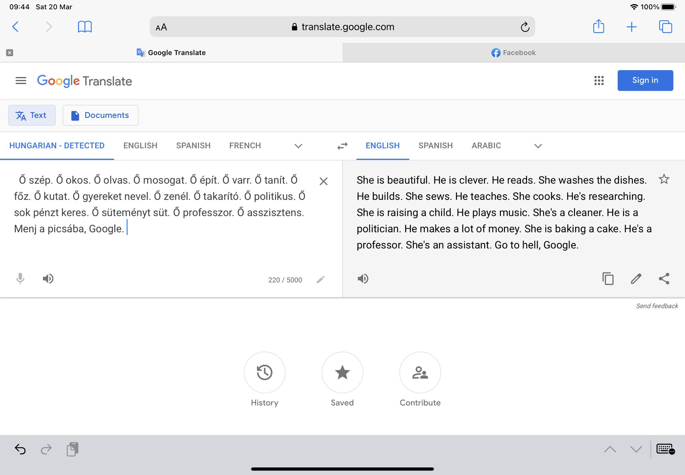
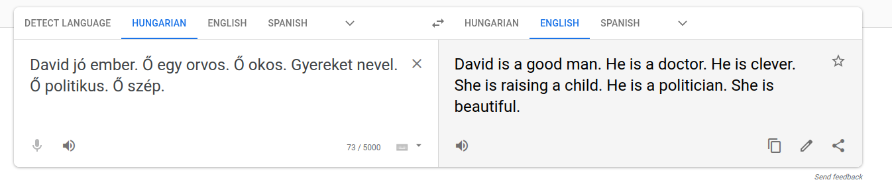

In March 2021,
a certain corner of the internet
was shocked by [a tweet][tweet]
which purports to highlight
rampant sex-based bias in
Google Translate.
The tweet shows a translation from Hungarian,
which has no separate pronouns for male and females,
into English.
The text contains several sentences
of "he/she is X".
The English translation
is not consistent
with the gendered pronouns
it assigns to the sentences.
Some of the sentences assigned the male pronoun
in English
are
"he is a politician",
"he is clever",
"he's a professor".
The sentences assigned the female pronoun include
"she is beautiful",
"she washes the dishes",
"she is raising a child".

You would be forgiven for thinking
that I got the date wrong.
2021,
really?
Haven't we been through all of this before?
I was questioning my own sanity when I saw this tweet.
Google Translate's sexist bias
has been known for years,
but what's crazier
is that _Google is aware of the problem_.
They published [a blog][bias-blog]
explaining the issue
and the steps they have taken to avoid bias.
The solution was,
I thought,
a perfect one;
rather than assume
gender when translating from a genderless language,
they offer both male and female translations.
Apparently,
sometime since that blog Google have decided
that that was the wrong solution
and have reverted to assuming gender.
[Given their recent issues with AI ethics][timit],
this isn't much of a surprise.

While the replies to the revalatory tweet
were mostly ones of disgust,
there were some
well-liked and retweeted
replies which blithely dismiss
this as a non-issue.
"Algorithms can't be biased"
is a oft-used retort
to claims of unfairness
borne from AI.
Of course they can't,
but humans can,
and algorithms are,
for now at least,
a product of fully human origin.
"To be fair,
it's not Google's fault",
begins one reply.
"It's using a statistical language model
build [sic] from data scrapped [sic] from the web."
The second half of that statement
is a matter of fact,
but there is some logic missing
which has caused the author
to allow
Google to abrogate responsibility.
Google Translate is,
after all,
a Google product.
Google engineers built it,
Google product managers
signed off on its release
to the world,
Google profit from it.

Deferring to "that's just what the data looks like"
is a neat way to avoid responsibility.
Yes,
it could well be true that
"he is clever" occurs more times
in the training data
than "she is clever".
And yes,
a model trained on that data would,
without concerted interference,
be more likely
to output
the male version of the sentence.
If this data imbalance does exist,
it could be down to several causes,
some more benign than others.
But Translate is not being
trained on all text data in the world,
merely a subset of it.
Language datasets are often scraped from
websites like Wikipedia
and Reddit.
Both of those sites have
a male-leaning bias
in contributor demographics,
so it would not be surprising
to find imbalances in gendered statements.
Here we arrive at the first issue
with the "it's just reflecting the world" argument.
The choice of dataset is an active choice by Google.
If there is a bias,
it's not "just the way the data is",
it's the way _Google's_ data is.

But arguing about whether the data's
bias is malicious or benign obscures
a far more pertinent point.
Google Translate,
as demonstrated in that tweet,
is a broken product.
When we ask for a translation,
we don't care whether most doctors
in the world are men.
We don't care whether women
are more often referred to
as beautiful than clever.
We care about what the author
of the sentence in question meant.
We care about whether the individual in that text
is a man or a woman.
Translate has imported biases from elsewhere in the world
into its translations,
rather than looking in the text for the truth
of whether the individual should be
he,
she,
or they.
You might rightly point out
that there is no useful context
in the translated paragraph
which would allow Translate to do this.
Yes,
but a context does exist somewhere.
Why should Google decide what this should be?
When people use Translate,
they don't typically paste a whole text,
rather the odd sentence or two,
so translations are bound to be ambiguous.
Choosing to import bias from the training data
will produce incorrect translations
and may confuse the user.
The correct solution for when context cannot be decided is,
as Google previously stumbled upon,
to offer both male and female translations.

But as it turns out,
Translate is bad at context.
Beginning the paragaph with "David is a good man"
will inform any human
that all subsequent sentences would be referring to David,
and consequently should be "he is"
rather than "she is".
But the translation from Hungarian
to English
still makes the same
sexist mistakes.
Given that Translate can't work out context
very well,
multi-gendered
output should be the default.

The damning conclusion
from this is not that bias in Translate exists,
it is that it will continue to exist
for a long time.
Every machine learning engineer
should by now be aware of fairness issues;
top conferences have made concerted effort
in recent years
to promote research in fair ML.
What's more,
we know that Google is aware of this issue,
because they wrote about it
three years ago.
The fact that it remains
suggests that it is a conscious decision
by Google management
to not fix it.
Why?
I couldn't begin to guess.
Has this stance been taken
in other Google products?
Almost certainly.
So if Google Translate being a bit sexist
doesn't concern you,
at least try to remember this
the first time you step
in a Google self-driving car.

[bias-blog]: https://www.blog.google/products/translate/reducing-gender-bias-google-translate/
[timit]: https://www.theverge.com/2020/12/3/22150355/google-fires-timnit-gebru-facial-recognition-ai-ethicist
[tweet]: https://twitter.com/DoraVargha/status/1373211762108076034
